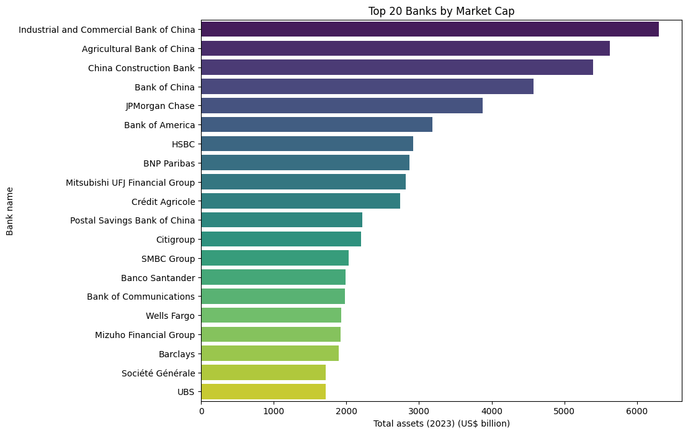

## Detailed Functionality

### 1. Logging Function

- **Purpose**: To record the progress and any issues encountered during the ETL process.
- **Implementation**: A logging function is implemented to write log entries to `logs/code_log.txt`.

### 2. Extraction of Data

- **Web Scraping**: 
  - **Source**: Data is extracted from a website containing information on the world's largest banks.
  - **Tools**: `requests` library is used to fetch the webpage, and `BeautifulSoup` is used to parse the HTML content.
  - **Process**: The relevant data is identified and extracted from the HTML structure.

### 3. Transformation of Data

- **Data Cleaning**: 
  - **Purpose**: To ensure the data is in a usable format.
  - **Tools**: `pandas` library is used for data manipulation.
  - **Process**: The extracted data is cleaned by removing unnecessary characters, handling missing values, and converting data types.
- **Data Formatting**: 
  - **Purpose**: To format the data according to the desired schema.
  - **Tools**: `pandas` library is used for data transformation.
  - **Process**: The cleaned data is transformed into a structured format suitable for analysis and storage.

### 4. Loading to CSV

- **Purpose**: To save the transformed data into a CSV file for easy access and analysis.
- **Tools**: `pandas` library is used to write the data to a CSV file.
- **Output**: The final data is saved in `output/Largest_banks_data.csv`.

### 5. Loading to Database

- **Purpose**: To store the transformed data in a database for efficient querying and analysis.
- **Tools**: `sqlite3` library is used to interact with the SQLite database.
- **Process**: The transformed data is loaded into a database table.

### 6. Function to Run Queries on Database

- **Purpose**: To provide an interface for running SQL queries on the database.
- **Implementation**: Functions are implemented to execute SQL queries and fetch results from the database.
- **Usage**: These functions can be used to perform various analyses on the stored data.

### 7. Verify Log Entries

- **Purpose**: To ensure the ETL process is recorded correctly and to identify any issues.
- **Process**: The log entries in `logs/code_log.txt` are verified to check the progress and any errors encountered during the ETL process.
=======
## ETL with Python

##### Project for Cloud Data Engineering Roadmap

### Project 01 : Acquiring and processing information on world's largest banks

- Task 1: Logging function
- Task 2 : Extraction of data
- Task 3 : Transformation of data
- Task 4: Loading to CSV
- Task 5: Loading to Database
- Task 6: Function to Run queries on Database
- Task 7: Performed Analytics Using Pandas
- Task 8: Verify log entries

## Archiecture

## Top 20 Banks Chart

